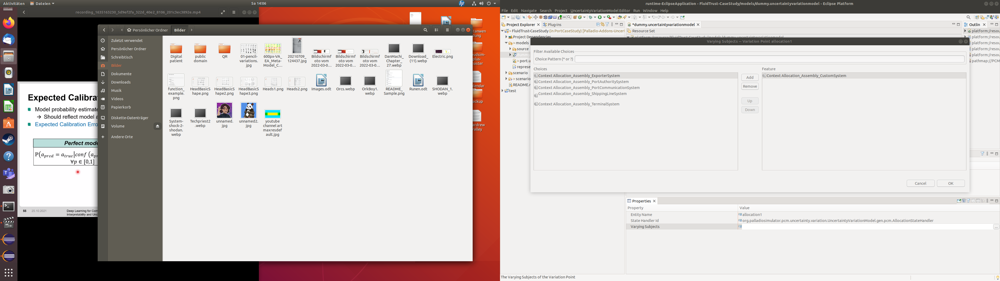

# Palladio-Addons-Uncertainty-VariationCreation

## Introduction
This project extends the Palladio Component Model as well as the models of the Fluid Trust Project with the functionality to automatically generate parallely existing variants from these basis models. This 
generation is controlled through the Uncertainty Variation Model and the state handlers. The Uncertainty Variation Model contains the variation points that affect the source models with their possible values. 
 bv The state handlers realisize the transformation of the source models to the different variants based on the Uncertainty Variation Models description. 

## Requirments
The features Uncertainty Variation Creation and Uncertainty Variation PCM Creation require the following Packages:
* Palladio Commons Identifier from the Location https://updatesite.palladio-simulator.com/palladio-build-updatesite/nightly/
* Palladio Component Model from the Location https://updatesite.palladio-simulator.com/palladio-build-updatesite/nightly/
* Palladio Workflow Engine Core from the Location https://updatesite.palladio-simulator.com/palladio-build-updatesite/nightly/
* Emf Edit Utils from the Location https://updatesite.mdsd.tools/library-emfeditutils/releases/latest/
* EMF - Eclipse Modeling Framework SDK from the Location http://download.eclipse.org/releases/2021-12
* SLF4J API Module from the Location https://download.eclipse.org/tools/orbit/downloads/drops/R20211213173813/repository

The feature Uncertainty Variation Dataflow Creation requires additionally the following Packages:
* Data Flow Confidentiality Tree Editors from the Location https://updatesite.palladio-simulator.com/fluidtrust/fluidtrust-build-updatesite/nightly/
* Data Flow Confidentiality Meta Models from the Location https://updatesite.palladio-simulator.com/fluidtrust/fluidtrust-build-updatesite/nightly/
* PCM Data Flow Confidentiality Tree Editor from the Location https://updatesite.palladio-simulator.com/fluidtrust/fluidtrust-build-updatesite/nightly/
* PCM Data Flow Confidentiality Model from the Location https://updatesite.palladio-simulator.com/fluidtrust/fluidtrust-build-updatesite/nightly/
* Data Dictionary Tree Editor from the Location https://updatesite.palladio-simulator.com/fluidtrust/fluidtrust-build-updatesite/nightly/
* Data Dictionary Meta Model from the Location https://updatesite.palladio-simulator.com/fluidtrust/fluidtrust-build-updatesite/nightly/
* Characterized Data Dictionary DSL from the Location https://updatesite.palladio-simulator.com/fluidtrust/fluidtrust-build-updatesite/nightly/
* PCM Data Flow Confidentiality Dictionary DSL from the Location https://updatesite.palladio-simulator.com/fluidtrust/fluidtrust-build-updatesite/nightly/

The building and testing requires additionally the following Packages:
* MWE2 from the Location http://download.eclipse.org/releases/2021-12
* Uml2 from the Location http://download.eclipse.org/releases/2021-12
* Xtext from the Location http://download.eclipse.org/releases/2021-12
* MDSD.tools EcoreWorkflow MWE2 Library from the Location https://updatesite.mdsd.tools/ecore-workflow/releases/latest/
* MDSD.tools EcoreWorkflow MWE2 Library for Xtext from the Location https://updatesite.mdsd.tools/ecore-workflow/releases/latest/
* JUnit5 Jupiter (already installed in Eclipse)

## Usage

The following subsections will describe the generation of a new Uncertainty Variation project as well as the generation of variation through an existing Uncertainty Variation project.

### New Uncertainty Variation Project

1. Create a new Modeling project
2. Create a subfolder in this project, which will later contain the sources
    1. Create a new Uncertainty Variation Model inside this subfolder through Example EMF Model Creation Wizards Uncertainty Variation Model with Uncertainty Variations as Model Object
       
       
       
    2. Create a subfolder inside this subfolder, which will later contain the orginal Palladio Component Model
        1. Create a new Palladio Components Model inside of the current folder
        2. Optionally create a new Data Confidential Model inside of the current folder
        3. Configure the Uncertainty Variation Model
            1. Add required resources of the Palladio Component Model or Data Confidential Model
               
            2. Add a new variation point to the Root Element
               
                1. Set the entity name of this variation point
                2. Set the state handler of this variation point
                   
                    - org.palladiosimulator.pcm.uncertainty.variation.UncertaintyVariationModel.gen.pcm.AllocationStateHandler: varies the ResourceContainer of a given AllocationContext
                    - org.palladiosimulator.pcm.uncertainty.variation.UncertaintyVariationModel.gen.pcm.statespace.statehandler.pcm.AssemblyStateHandler: varies the RepositoryComponent of given AssemblyContexts. 
                      This state handler corrects additionally the AssemblyConnectors that go to and go from one of the AssemblyContexts to change.
                    - org.palladiosimulator.pcm.uncertainty.variation.UncertaintyVariationModel.gen.pcm.statespace.statehandler.pcm.BranchStateHandler: varies the taken branch of given Branch's or BranchActions.
                    - org.palladiosimulator.pcm.uncertainty.variation.UncertaintyVariationModel.gen.pcm.statespace.statehandler.pcm.CharacteristicsStateHandler: varies the Literals of given EnumCharacteristics.
                3. Set the varying subjects, which are the elements that will be modified during the generation, to this variation point
                   
                4. Add a variation description to this variation point in the case the state handler operates on external data
                   
                    1. Add a primitive value or value collection (if more then one element can simultaneously exist) to the variation description
                      
                        1. Set the link or links (in case of a value collection), which are the elements that vary, to this primitive value or  value collection
                    2. Repeat with the next value until all required values have been added to the variation description
            3. Repeat with the next resource until all required variation points have been added

### Variant Generation with UI

1. Open view Project Explorer
2. Open the desired Uncertainty Variation Project
3. Right click on the Uncertainty Variation Model of this Project
   
4. Select Generate Uncertainty Variations to run the generation of the different variants based of the Uncertainty Variation Model. The result of the generation can be found inside this projects 
   autogenerated folder named  scenarios.
   

### Variant Generation with Workflow

The Package org.palladiosimulator.pcm.uncertainty.variation.UncertaintyVariationModel.gen.pcm.workflow contains the UncertaintyWorkflowJob that integrates the variant generation into the 
[Palladio Workflow Engine](https://sdqweb.ipd.kit.edu/wiki/Palladio_Workflow_Engine). This job receives as argument the uri of the Uncertainty Variation Model that shall be used for the 
generation.

## Development

### New State Handler

1. Create a Plug-in Project for the new state handler
2. Add the Uncertainty Variation Model Package to the required Plug-ins
3. Create the new state handler implementation as implementation of the the StateHandler interface and subclass of GenericStateHandler
   
4. Add the state handler implementation extension point if it does not exist
   
5. Register newly generated state handler implementation with name and id under the state handler implementation extension point
   
    1. Set subject type of varying subject definition
       
    2. Repeat with next subject type until all subject types that this state handler implementation handles are defined. The different subject types define an or concatenated list of filters for the 
       varying subjects of the variation point that uses this state handler.
       
    3. Add variation description definition to the state handler implement in the case of external defined variation values
       
        1. Set value type of variation description definition
           
        2. Repeat with next value type until all value types that this state handler implementation handles are defined. The different value types define an or concatenated list of filters for the 
           primitive value's link or value collection's links of the variation point that uses this state handler.
           
5. Repeat with the next state handler implementation until all wanted implementation are realized
   

### Uncertainty Variation Model

The following section describes the Uncertainty Variation Model in detail.

* UncertaintyVariation: represents the models main entry class. 
    * The association variationPoints contains the different variation points of an Uncertainty Variation Model.
* VariationPoint: represents one variation point.
    * The property stateHandlerId defines the type that the variation point has in form of the state handler that shall be used.
    * The property entityName defines the name that is used to describe the variation point.
    * The association varyingSubjects connects this variation point with at least one concrete element inside of the palladio component model that will be varied by this variation point.
    * The association variationDescription can contain the description of variation of this variation point.
* VariationDescription: represents the description of the form that the variation has. The VariationDescription is currently used only for external variations.
    * The association targetVariations contains at least one the different values that the variation point can take.
* Value: represents an abstract value that the variation point can take.
* PrimitiveValue: represent a single value that the variation point can take.
    * The association link connects this single value with a concrete element inside of the palladio component model.
* ValueCollection: represent a group of values that the variation point can simultaneously take.
    * The association links connects this group of values with concrete elements inside of the palladio component model.

